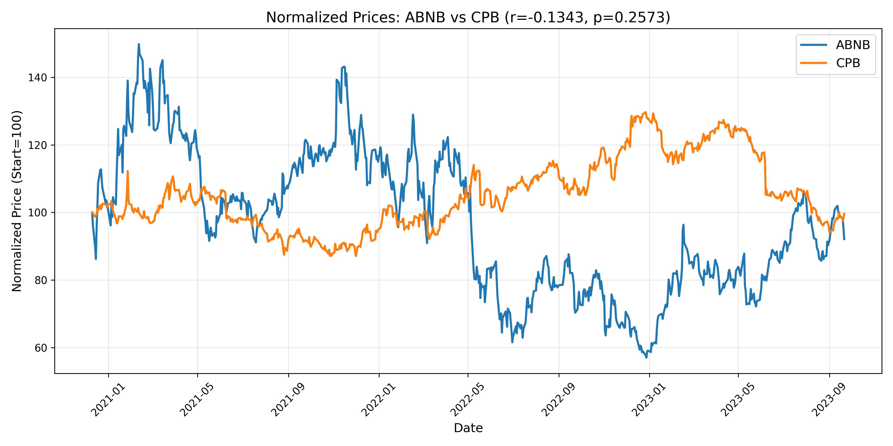
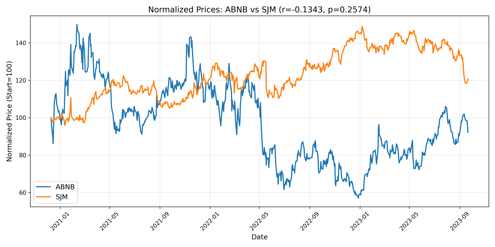
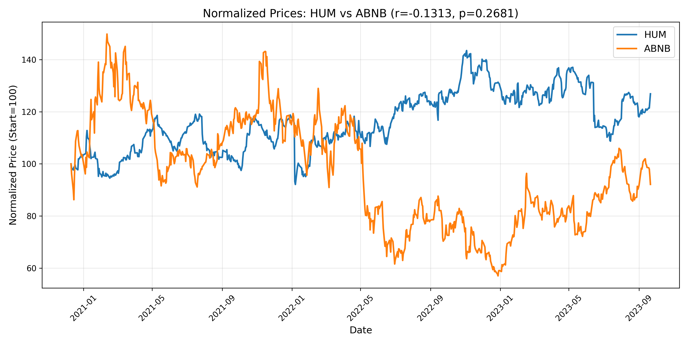
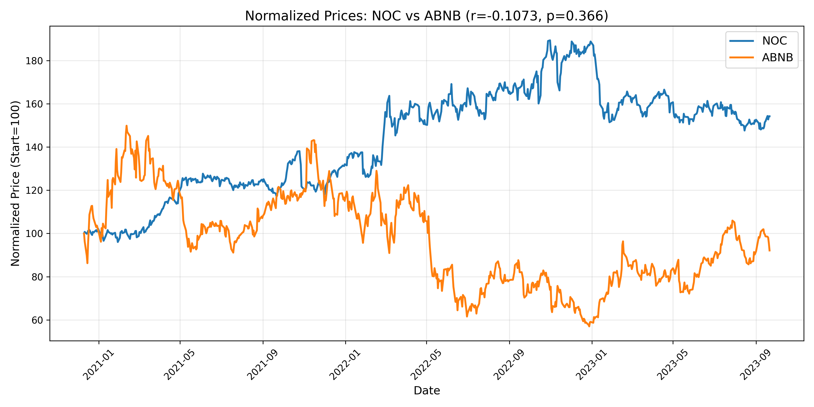

# Inverse‑Pair Finder: Sector Rotation & Hedge Analysis

This repository identifies and visualizes pairs of assets that move inversely—helpful for hedging, sector‑rotation studies, and quantitative trading strategies. We scan a universe of equities (or ETFs), compute pairwise Pearson correlations on returns, and produce both normalized‑price charts and return‑scatter plots for the strongest inverse relationships.

---

## Project Objectives

1. **Compute Pairwise Correlations**  
   - Convert price series to returns at your chosen frequency (daily, weekly, bi‑weekly, etc.)  
   - Calculate Pearson *r* and p‑values for every pair in the universe  

2. **Filter for Inverse Pairs**  
   - Select pairs with correlation ≤ –threshold and statistically meaningful p‑values  
   - Focus on the top *N* most inverse relationships for further analysis  

3. **Visualize Results**  
   - Generate normalized‑price plots showing one asset at 100 and the other’s inverse drift  
   - Create daily‑return scatter plots with regression lines, slopes, and r‑values in the legend  

4. **Support Interactive Exploration**  
   - Provide a CLI to plot specific ticker pairs on demand  
   - Offer a consolidated multi‑panel view of the top inverse pairs  

---

## Core Files

| File                   | Description                                                                                  |
|------------------------|----------------------------------------------------------------------------------------------|
| `src/pipeline.py`      | Ingests raw price CSVs, computes returns, calculates all correlations, and writes to `correlations/correlations.json`. |
| `src/plot_pairs.py`    | CLI script: loads `correlations/correlations.json` and plots the top N inverse pairs to `result/`. |
| `src/analyzer.py`      | Helper functions for ranking and filtering correlations.                                     |
| `data/`                | Contains raw price data as CSV files (`<TICKER>.csv`).                                       |
| `correlations/`        | Stores the output JSON from the pipeline (`correlations.json`).                              |
| `result/`              | Stores the output plots generated by `plot_pairs.py`.                                        |

---
## Case Study: Airbnb (ABNB) Inverse Relationships

We pulled out the top 4 ABNB inverse pairs (|r| ≥ 0.13, p ≈ 0.25–0.37) and plotted their normalized‑price series:

| Pair             | Correlation | p‑Value | Chart                                                 |
|------------------|------------:|--------:|-------------------------------------------------------|
| ABNB vs CPB      | −0.1343     | 0.2573  |       |
| ABNB vs SJM      | −0.1343     | 0.2574  |       |
| HUM vs ABNB      | −0.1313     | 0.2681  |       |
| NOC vs ABNB      | −0.1073     | 0.3660  |       |

**Why this inverse behavior?**

- **Sector rotation & risk appetite:**  
  - **CPB (Campbell Soup) & SJM (J.M. Smucker)** are consumer‑staple names. In risk‑off periods (when investors flock to defensives), staples tend to rally **while** travel‑and‑leisure (ABNB) lags.  
  - **HUM (Humana)** is in health‑care; likewise, it can outperform when growth/travel names pull back.  
  - **NOC (Northrop Grumman)** is defense/industrial—also considered defensive when macro uncertainty rises.  

In short, during market stress or rising recession fears, investors rotate **out** of high‑beta, discretionary names like Airbnb and **into** staples, health‑care, or defense. That risk‑off/sectors‑switch dynamic drives these modest but consistent inverse correlations.

---
